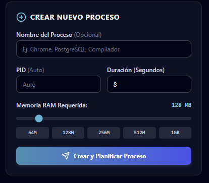
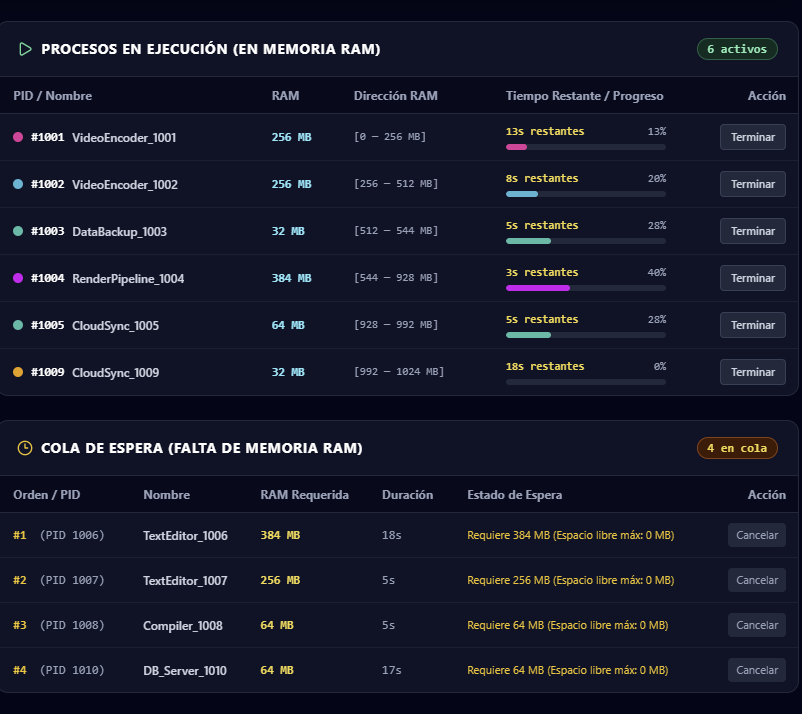
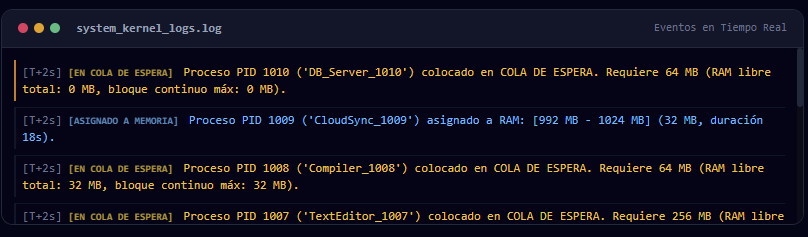
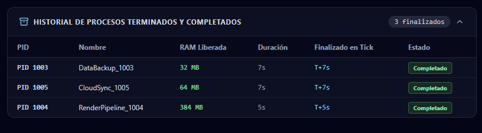

# Simulador de Gestión de Procesos en Memoria RAM

Aplicación web desarrollada en **Python & Django** para la simulación interactiva de asignación dinámica de memoria RAM (1 GB = 1024 MB), planificación de procesos concurrentes, cola de espera (FIFO) y liberación automática de recursos en un sistema operativo con 1 CPU.

---

## 📸 Vista General y Componentes de la Interfaz

### 1. Panel Superior y Controles de Simulación
Control del reloj global del sistema operativo, botón Play/Pausa (auto-tick), avance manual paso a paso (`+1s`), selector de velocidad de ejecución (0.5x, 1.0x, 2.0x) y cambio dinámico entre algoritmos de asignación (**First-Fit**, **Best-Fit**, **Worst-Fit**).


---

### 2. Monitor de Estado y Métricas en Tiempo Real
Tarjetas informativas en vivo: consumo total de RAM (sobre 1024 MB), procesos concurrentes activos en CPU, cantidad de procesos en cola de espera e historial acumulado de finalizados.


---

### 3. Mapa Dinámico de Memoria RAM (1024 MB)
Visualizador gráfico segmentado que muestra la distribución exacta de los bloques asignados a cada proceso, sus rangos de direcciones continuas `[inicio - fin MB]`, el tiempo restante y los bloques de memoria libre con detección de fragmentación externa.


---

### 4. Creación y Generación de Procesos

| Creación de Proceso Individual | Generador Rápido por Lotes |
| :---: | :---: |
|  |  |
| *Formulario con asignación de PID, nombre, selector de RAM (MB) y duración (s).* | *Generación automática con perfiles de carga (Ligero, Balanceado, Pesado o Mixto).* |

---

### 5. Planificación y Concurrencia de Procesos
Monitoreo en tiempo real de los procesos activos en memoria RAM con barra de progreso y cuenta regresiva en paralelo, junto a la cola de espera FIFO de procesos retenidos por falta de memoria disponible.



---

### 6. Terminal de Eventos del Kernel (Logs en Vivo)
Consola de eventos del sistema operativo en tiempo real (`system_kernel_logs.log`) con marcas de tiempo ($T$) y eventos clasificados por tipo (creación, admisión en RAM, encolamiento, finalización con liberación de memoria y terminación manual forzada).



---

### 7. Historial de Procesos Finalizados
Registro histórico de todos los procesos completados y terminados, detallando la memoria RAM liberada y el ciclo de reloj en que finalizaron.



---

## 🚀 Características Principales

1. **Gestión Dinámica de Memoria RAM (1024 MB / 1 GB)**:
   - Visualizador gráfico interactivo en tiempo real del mapa de memoria (`0 MB` a `1024 MB`).
   - Algoritmos de asignación contigua: **First-Fit**, **Best-Fit** y **Worst-Fit**.
   - Detección visual de bloques ocupados, rangos de direcciones, espacios libres y métricas de fragmentación.

2. **Gestión Completa de Procesos**:
   - **PID Único**: Autoincremental o personalizado por el usuario.
   - **Nombre Descriptivo**: Ingresado por el usuario o autogenerado dinámicamente si se omite.
   - **Consumo de Memoria**: Especificado en MB (con slider y botones rápidos de 64M, 128M, 256M, 512M, 1GB).
   - **Duración**: Tiempo total de ejecución en segundos con cuenta regresiva en vivo y barra de progreso.

3. **Multiprogramación y Concurrencia**:
   - Todos los procesos cargados en memoria RAM avanzan en paralelo en cada segundo (tick).
   - Los procesos que no caben por falta de espacio contiguo entran automáticamente a la **Cola de Espera**.

4. **Liberación y Reasignación Automática**:
   - Al llegar a 0s, el proceso pasa a estado `COMPLETED`, libera su bloque de memoria de inmediato y el planificador promueve automáticamente al siguiente proceso en cola que quepa en el espacio liberado.
   - Posibilidad de terminar manualmente (`Kill / Terminar`) cualquier proceso activo o de cola.

5. **Panel de Control y Monitor en Tiempo Real**:
   - Botón Play / Pause (simulación automática).
   - Botón Paso a Paso (`+1s`).
   - Control de velocidad: `0.5x`, `1.0x`, `2.0x`.
   - Generador rápido por lotes (3, 5, 8, 12 procesos con perfiles Ligero, Balanceado, Pesado o Mixto).
   - Consola de eventos del sistema operativo (`system_kernel_logs.log`) con marcas de tiempo.

---

## 🛠️ Requisitos e Instalación

- **Python 3.10+** (Probado en Python 3.14)
- **Django 5.x / 6.x**

Para instalar las dependencias:
```bash
py -m pip install django
```

---

## ⚙️ Cómo Ejecutar la Aplicación

1. Ubícate en la carpeta del proyecto:
   ```bash
   cd C:\projects\memory_simulator
   ```

2. Aplica las migraciones de la base de datos (si es la primera vez):
   ```bash
   py manage.py migrate
   ```

3. Inicia el servidor de desarrollo de Django:
   ```bash
   py manage.py runserver 8000
   ```

4. Abre tu navegador web en:
   👉 **http://127.0.0.1:8000/**

---

## 🧪 Ejecutar Tests Automatizados

Para verificar el correcto funcionamiento del gestor de memoria, la concurrencia y las API:
```bash
py manage.py test
```
